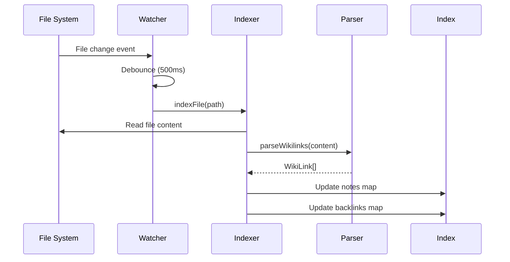
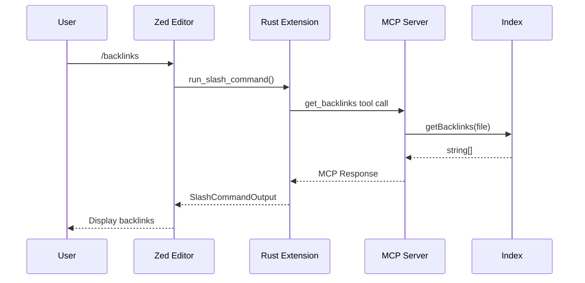

# RoamingZed System Architecture

> **Version**: 0.1.0  
> **Last Updated**: 2025-12-27

This document describes the system architecture of RoamingZed, a Zed editor extension for bidirectional wikilink support with AI integration.

---

## Overview

RoamingZed follows a **dual-component architecture**:

```mermaid
graph TB
    subgraph Zed Editor
        User[User]
        AI[AI Assistant]
        ZedExt[Rust Extension<br/>WASM]
    end
    
    subgraph MCP Server
        CLI[CLI Entry<br/>cli.ts]
        Server[MCP Server<br/>server.ts]
        Indexer[Link Indexer<br/>indexer.ts]
        Parser[Wikilink Parser<br/>parser.ts]
        Watcher[File Watcher<br/>watcher.ts]
    end
    
    subgraph File System
        MD[Markdown Files<br/>*.md]
    end
    
    User -->|Slash Commands| ZedExt
    AI -->|@roamingzed Context| ZedExt
    ZedExt -->|npx roamingzed-mcp| CLI
    CLI --> Server
    Server --> Indexer
    Indexer --> Parser
    Watcher -->|File Changes| Indexer
    MD -->|Read| Indexer
    Watcher -->|Watch| MD
```

---

## Components

### 1. Rust Extension (`src/lib.rs`)

**Responsibility**: Zed integration layer

**Technology**: Rust compiled to `wasm32-wasip2`

**Key Functions**:

| Function | Purpose |
|----------|---------|
| `new()` | Initialize extension |
| `context_server_command()` | Launch MCP server via `npx roamingzed-mcp` |
| `run_slash_command()` | Execute `/backlinks`, `/graph`, `/related` |
| `complete_slash_command_argument()` | Provide auto-completions (TODO) |

**Dependencies**:
- `zed_extension_api = "0.7.0"`

**Build Target**: `wasm32-wasip2`

**Output**: `target/wasm32-wasip2/release/roamingzed.wasm`

---

### 2. MCP Server (`mcp-server/`)

**Responsibility**: Link indexing and AI context provision

**Technology**: TypeScript / Node.js 18+

#### 2.1 Entry Point (`cli.ts`)

```
npx roamingzed-mcp [--workspace <path>]
```

- Parses CLI arguments
- Resolves workspace root
- Starts MCP server

#### 2.2 Server (`server.ts`)

Implements Model Context Protocol with:

**Tools** (callable by AI):

| Tool | Description | Parameters |
|------|-------------|------------|
| `get_backlinks` | Pages linking to target | `file: string` |
| `get_outlinks` | Links from a page | `file: string` |
| `search_notes` | Search by title/path | `query: string, limit?: number` |
| `get_graph` | Link graph data | `file?: string, depth?: number` |
| `read_note` | Read note content | `file: string` |

**Resources** (static data):

| Resource URI | Description |
|--------------|-------------|
| `wikilinks://index` | Full link index JSON |
| `wikilinks://stats` | Index statistics |

#### 2.3 Indexer (`indexer.ts`)

**Data Structures**:

```typescript
interface NoteMetadata {
  path: string;      // Relative file path
  title: string;     // Derived from filename
  outlinks: string[]; // Parsed wikilink targets
  hash: string;      // MD5 for change detection
  mtime: number;     // Last modified timestamp
}

interface LinkIndex {
  root: string;                    // Workspace root
  notes: Map<string, NoteMetadata>; // Path → Metadata
  backlinks: Map<string, string[]>; // Target → Sources
  lastUpdated: number;
}
```

**Operations**:
- `buildIndex(root)`: Initial full scan
- `indexFile(index, path)`: Update single file
- `removeFile(index, path)`: Delete from index
- `getBacklinks(index, file)`: Query reverse links
- `getOutlinks(index, file)`: Query forward links
- `searchNotes(index, query, limit)`: Title/path search

#### 2.4 Parser (`parser.ts`)

**Regex Pattern**:
```regex
\[\[(?<target>[^\]|]+?)(?:\|(?<alias>[^\]]+))?\]\]
```

**Supported Syntax**:
- `[[target]]` → Basic link
- `[[target|alias]]` → Link with display text
- `[[folder/target]]` → Path-based link
- `[[target#heading]]` → Heading reference (partial)

**Output**:
```typescript
interface WikiLink {
  target: string;
  alias: string | null;
  start: number;
  end: number;
}
```

#### 2.5 Watcher (`watcher.ts`)

**Technology**: `chokidar`

**Behavior**:
- Watches `**/*.md` in workspace
- Ignores: `node_modules/`, `.git/`, `.obsidian/`, `.roamingzed/`
- Debounces updates (500ms default)
- Triggers `indexFile()` on add/change
- Triggers `removeFile()` on unlink

---

## Data Flow

### Indexing Flow



### Query Flow



---

## Directory Structure

```
roamingzed/
├── src/
│   └── lib.rs              # Zed extension (Rust/WASM)
├── mcp-server/
│   ├── src/
│   │   ├── cli.ts          # CLI entry point
│   │   ├── index.ts        # Module exports
│   │   ├── server.ts       # MCP server implementation
│   │   ├── indexer.ts      # Link index management
│   │   ├── parser.ts       # Wikilink parser
│   │   └── watcher.ts      # File system watcher
│   ├── dist/               # Compiled JavaScript
│   ├── package.json        # npm configuration
│   └── tsconfig.json       # TypeScript config
├── docs/
│   ├── roadmap.md          # Development roadmap
│   ├── architecture.md     # This document
│   ├── api-reference.md    # MCP API docs
│   └── testing.md          # Testing guide
├── extension.toml          # Zed extension manifest
├── Cargo.toml              # Rust project config
├── install.ps1             # Windows installer
├── install.sh              # Unix installer
├── README.md               # User documentation
├── DEVELOPMENT.md          # Developer guide
├── CONTRIBUTING.md         # Contribution guidelines
└── CHANGELOG.md            # Version history
```

---

## Technology Choices

### Why Rust + WASM?

- **Zed Requirement**: Zed extensions are WASM modules
- **Performance**: Native-speed execution in editor
- **Safety**: Memory-safe by design
- **Ecosystem**: Strong Zed Extension API support

### Why TypeScript for MCP Server?

- **MCP SDK**: Official SDK is TypeScript-first
- **Rapid Development**: Faster iteration than Rust for I/O-heavy code
- **npm Distribution**: Easy `npx` deployment

### Why Model Context Protocol?

- **Standardized**: Industry-standard AI context protocol
- **Decoupled**: Server logic separate from editor integration
- **Extensible**: Easy to add new tools/resources
- **AI-Native**: Designed for LLM consumption

---

## Extension Points

### Adding a New MCP Tool

1. Define tool in `server.ts`:
```typescript
server.tool(
  "tool_name",
  "Description for AI",
  { param: z.string().describe("Param description") },
  async ({ param }) => {
    // Implementation
    return { content: [{ type: "text", text: result }] };
  }
);
```

2. Export from `index.ts` if needed

### Adding a New Slash Command

1. Register in `extension.toml`:
```toml
[slash_commands.mycommand]
description = "Command description"
requires_argument = true
```

2. Handle in `lib.rs`:
```rust
fn run_slash_command(&self, command: SlashCommand, ...) {
    match command.name.as_str() {
        "mycommand" => self.run_mycommand(args, worktree),
        // ...
    }
}
```

---

## Security Considerations

- **File Access**: MCP server only reads files within workspace root
- **No Network**: No external network calls (except npm install)
- **Sandboxed**: WASM extension runs in Zed's sandbox
- **User Control**: Extension requires explicit installation

---

## Future Architecture Considerations

### Persistent Index Cache

```
.roamingzed/
├── cache.json      # Serialized LinkIndex
└── config.toml     # User preferences
```

### Multi-Workspace Support

Future architecture may support multiple workspace roots:

```typescript
interface MultiIndex {
  workspaces: Map<string, LinkIndex>;
  crossLinks: Map<string, string[]>; // Cross-workspace links
}
```

---

## Related Documents

- [Roadmap](./roadmap.md) - Development timeline
- [API Reference](./api-reference.md) - MCP tools documentation
- [Testing](./testing.md) - Testing strategy
- [Development Guide](../DEVELOPMENT.md) - Setup instructions
