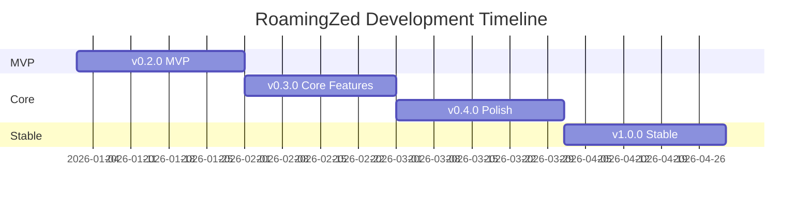
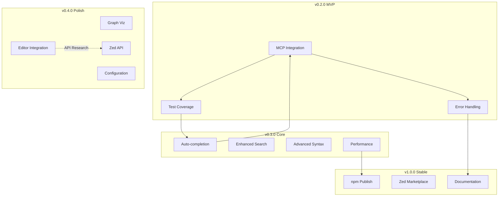

# RoamingZed Development Roadmap

> **Last Updated**: 2025-12-27  
> **Current Version**: v0.1.0 (Development Preview)

This document outlines the development roadmap for RoamingZed, a Zed editor extension providing bidirectional wikilink support with AI integration.

---

## Current Status (v0.1.0)

### ✅ Completed
- Rust extension framework with Zed Extension API v0.7
- MCP server architecture with TypeScript
- Wikilink parser (`[[target]]`, `[[target|alias]]`)
- Bidirectional link indexer with file watching
- Three slash commands: `/backlinks`, `/graph`, `/related`
- MCP tools: `get_backlinks`, `get_outlinks`, `search_notes`, `get_graph`, `read_note`
- MCP resources: `wikilinks://index`, `wikilinks://stats`
- Automated install scripts (Windows/Linux/macOS)
- Development documentation

### ⚠️ Known Limitations
- Slash commands return static help text, not actual query results
- No auto-completion for command arguments
- No editor integration (hover, click-to-navigate)
- Limited to title/path search (no semantic search)
- No persistent index cache
- No test coverage

---

## Priority Framework

| Priority | Definition | Target Audience |
|----------|------------|-----------------|
| **P0** | Blocks MVP release; core functionality | All users |
| **P1** | Significantly improves user experience | Power users |
| **P2** | Nice-to-have enhancements | Enthusiasts |
| **P3** | Future exploration; low urgency | Contributors |

---

## Milestone Overview

---

## v0.2.0 — MVP (Minimum Viable Product)

**Goal**: Make the extension actually functional end-to-end.

**Target**: Q1 2026

### P0: Rust ↔ MCP Integration

**Problem**: Slash commands currently return static placeholder text instead of querying the MCP server.

**Tasks**:
- [ ] Implement MCP client communication in Rust extension
- [ ] Wire `/backlinks` to call `get_backlinks` MCP tool
- [ ] Wire `/graph` to call `get_graph` MCP tool
- [ ] Wire `/related` to call `search_notes` MCP tool
- [ ] Handle MCP errors gracefully with user-friendly messages
- [ ] Add connection health checks and auto-reconnect

**Files**: `src/lib.rs`

**Dependencies**: None

**Estimated Effort**: 3-5 days

---

### P0: Basic Test Coverage

**Problem**: Zero test coverage makes refactoring risky.

**Tasks**:
- [ ] Set up Rust test framework with mock Zed API
- [ ] Unit tests for wikilink parser (`parser.ts`)
- [ ] Unit tests for indexer functions (`indexer.ts`)
- [ ] Integration test for MCP server startup
- [ ] Add test commands to npm scripts

**Files**: `mcp-server/src/*.test.ts`, `src/lib.rs`

**Dependencies**: None

**Estimated Effort**: 2-3 days

---

### P0: Error Handling & Logging

**Problem**: Errors are not properly surfaced or logged.

**Tasks**:
- [ ] Replace `console.error` with structured logging (pino/winston)
- [ ] Add log levels (debug, info, warn, error)
- [ ] Implement `--debug` flag for verbose output
- [ ] Create error catalog with codes and recovery hints
- [ ] Add user-facing error messages for common failures

**Files**: `mcp-server/src/*.ts`, `src/lib.rs`

**Dependencies**: None

**Estimated Effort**: 1-2 days

---

## v0.3.0 — Core Features

**Goal**: Deliver the core value proposition of intelligent wikilink management.

**Target**: Q1-Q2 2026

### P1: Slash Command Auto-completion

**Problem**: `/related` requires typing the full query with no suggestions.

**Tasks**:
- [ ] Implement `complete_slash_command_argument` in Rust
- [ ] Query MCP server for note list
- [ ] Fuzzy match user input against titles
- [ ] Support path completion (`folder/note`)
- [ ] Cache completion results for performance

**Files**: `src/lib.rs` (line 41-53)

**Dependencies**: v0.2.0 MCP integration

**Estimated Effort**: 2-3 days

---

### P1: Enhanced Search

**Problem**: Current search is exact substring match on title/path only.

**Tasks**:
- [ ] Add full-text content search
- [ ] Implement tag parsing (`#tag`)
- [ ] Add link proximity scoring (notes sharing common links rank higher)
- [ ] Support boolean operators (AND, OR, NOT)
- [ ] Add search result ranking by relevance

**Files**: `mcp-server/src/indexer.ts`, `mcp-server/src/server.ts`

**Dependencies**: None

**Estimated Effort**: 3-4 days

---

### P1: Advanced Wikilink Syntax

**Problem**: Only basic `[[target]]` and `[[target|alias]]` supported.

**Tasks**:
- [ ] Parse block references: `[[note#^block-id]]`
- [ ] Parse heading links: `[[note#Heading]]` (enhance existing)
- [ ] Parse embed syntax: `![[note]]`
- [ ] Support date links: `[[2024-12-27]]`
- [ ] Handle multi-level paths: `[[folder/subfolder/note]]`

**Files**: `mcp-server/src/parser.ts`

**Dependencies**: None

**Estimated Effort**: 2-3 days

---

### P1: Performance Optimization

**Problem**: Large vaults (>1000 notes) may cause performance issues.

**Tasks**:
- [ ] Implement persistent index cache (`.roamingzed/cache.json`)
- [ ] Add incremental indexing (only reindex changed files)
- [ ] Parallelize file parsing with worker threads
- [ ] Add lazy loading for rarely accessed notes
- [ ] Create performance benchmarks

**Files**: `mcp-server/src/indexer.ts`, `mcp-server/src/watcher.ts`

**Dependencies**: None

**Estimated Effort**: 3-4 days

---

## v0.4.0 — Polish

**Goal**: Refine user experience and add quality-of-life features.

**Target**: Q2 2026

### P2: Graph Visualization

**Problem**: `get_graph` returns raw JSON, not visualizable directly.

**Tasks**:
- [ ] Generate Mermaid diagram syntax for small graphs
- [ ] Add node weights (link count) to graph data
- [ ] Implement community detection for clustering
- [ ] Export to D3.js/Vis.js compatible format
- [ ] Add orphan node (unlinked) detection

**Files**: `mcp-server/src/server.ts`

**Dependencies**: None

**Estimated Effort**: 2-3 days

---

### P2: Editor Integration

**Problem**: No in-editor wikilink interaction (Zed API permitting).

**Tasks**:
- [ ] Research Zed Extension API capabilities for:
  - Hover preview (show linked note content)
  - Click-to-navigate (jump to link target)
  - Inline completion (suggest links while typing `[[`)
- [ ] Implement feasible features based on API support
- [ ] Add diagnostic for broken links (non-existent targets)

**Files**: `src/lib.rs`

**Dependencies**: Zed API research

**Estimated Effort**: Variable (depends on API support)

---

### P2: Configuration System

**Problem**: No user customization options.

**Tasks**:
- [ ] Create `.roamingzed/config.toml` schema
- [ ] Configurable ignore patterns
- [ ] Configurable wikilink syntax variants
- [ ] Index refresh interval setting
- [ ] Multi-workspace configuration

**Files**: New `mcp-server/src/config.ts`

**Dependencies**: None

**Estimated Effort**: 2 days

---

## v1.0.0 — Stable Release

**Goal**: Production-ready, well-documented, community-supported.

**Target**: Q2-Q3 2026

### P2: npm Package Publication

**Tasks**:
- [ ] Finalize `package.json` metadata
- [ ] Add npm prepublish scripts
- [ ] Publish `roamingzed-mcp` to npm registry
- [ ] Document npx usage: `npx roamingzed-mcp`

---

### P2: Zed Extension Marketplace

**Tasks**:
- [ ] Ensure extension.toml compliance
- [ ] Create extension icon/banner
- [ ] Submit to Zed extension registry
- [ ] Set up update notification mechanism

---

### P2: Documentation & Community

**Tasks**:
- [ ] Complete API reference documentation
- [ ] Create video tutorial
- [ ] Set up GitHub Discussions
- [ ] Create issue templates (bug, feature, question)

---

## Future Exploration (P3)

These are speculative features for post-1.0 development:

### AI Enhancement
- [ ] Smart link suggestions based on content similarity
- [ ] Auto-tagging with AI classification
- [ ] Natural language graph queries ("What notes relate to X?")
- [ ] AI-generated note summaries for hover preview

### Multi-Workspace
- [ ] Cross-vault linking
- [ ] Workspace switching command
- [ ] Shared link namespace

### Analytics
- [ ] Knowledge graph statistics dashboard
- [ ] Link health report (broken, orphan, hub nodes)
- [ ] Temporal analysis (note creation/modification trends)

### Markdown Oxide Collaboration
- [ ] Detect co-existence with Markdown Oxide
- [ ] Share index data if possible
- [ ] Coordinate feature scopes (RoamingZed = AI, Oxide = editing)

---

## Dependency Graph

---

## Contributing

We welcome contributions! See [CONTRIBUTING.md](../CONTRIBUTING.md) for guidelines.

**High-impact areas for contributors**:
- Test coverage (always welcome)
- Parser enhancements (P1)
- Documentation improvements
- Performance benchmarks

---

## Changelog

See [CHANGELOG.md](../CHANGELOG.md) for version history.
